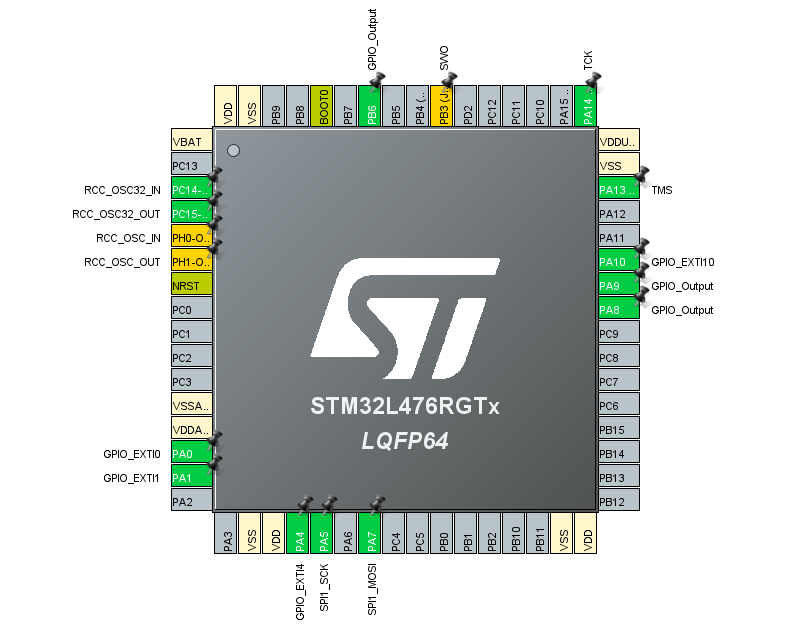
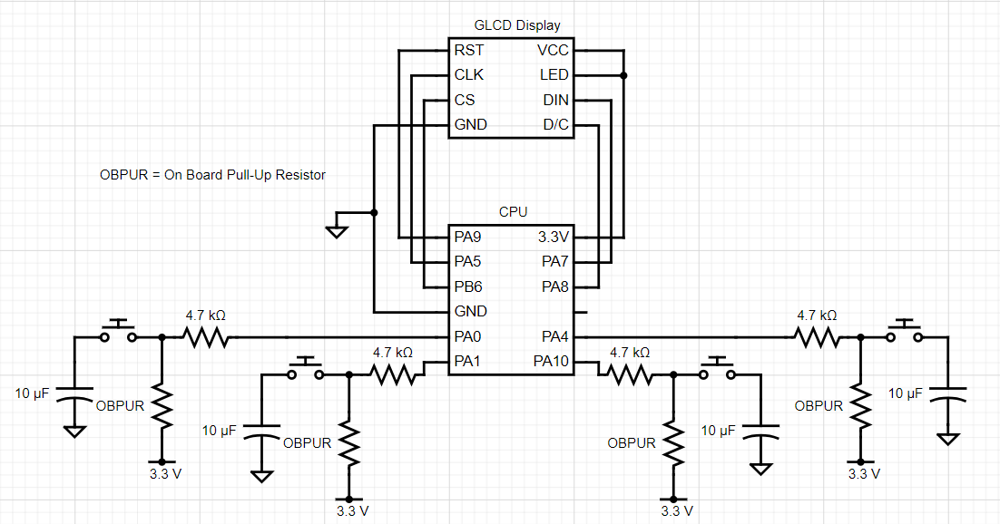

# Slide Puzzle

## Development Environment

- C Programming Language
- STM32CubeIDE
    - STM32CubeMX drivers

## Description of Project

The system that I created uses a 48x84 pixel display with each row being divided into 6 different banks. Each of these banks has 8 pixels in each column so to make specific pixels turn on a 2-digit, 1-byte, hexadecimal code is used per column. 

I created a table that holds all of the numbers from 1-11 which took up 2 banks and 21 columns using hexadecimal codes. Along with the number 1-11 I also included a blank space which would determine which pieces could be slid where. To position the pixels in the correct slots in the banks/columns I used the GLCDsetCursor() driver and each puzzle piece was spaced 21 columns apart from each other so that the puzzle was a 3x4 piece puzzle with the blank space ending at the bottom right.

The code has a blankIndex variable that is always being updated and a switch case tells the interrupts which pieces are allowed to be moved into the blank space. 4 hardware buttons coded to interact with those previously mentioned interrupts move the allowed pieces left, down, up, or right. 

Two integer arrays hold the random configuration of the 12 numbers, 0(blank space) - 11, and an array that has the numbers listed in order with 0 at the end. Every time a piece is moved the random array moves the numbers in correlation with what is seen on the digital display so that within the infinite while loop, there is an if statement checking the two arrays until they are equal to each other meaning that the puzzle has been solved.

Once the puzzle is solved, the screen displays the amount of time it took to solve the puzzle by displaying the value of the timer that is running throughout the solving process with a message saying ”GREAT JOB!! :)”. This is printed from a separate table that holds characters that take up 1 bank and are 7 pixels wide. 

## Demonstration

Here is a quick video showcasing how the project works!

[Slide Puzzle Demonstration](https://youtu.be/9lBV3hiRxFU)

##  Parts List
* Nucleo-L476RG board and USB cable
* PCD8544 GLCD screen
* 4 4.7k-resistors
* 4 push button switches
* 4 10 µF capacitors
* Several jumper wires

## IOC

You will need to download the IOC file or copy the changes I made on the graphical interface. Here is a picture of the graphical interface, but not all the settings like the timer and display settings are shown.

## Schematic

## Constraints
One constraint that kept appearing while wiring the buttons was some button bouncing so I tried to prevent that with capacitors and some delays, but it never came out
perfect. The capacitors and delays do reduce the button bouncing greatly and the program no longer crashes so it is still fully functional along with that constraint. 
